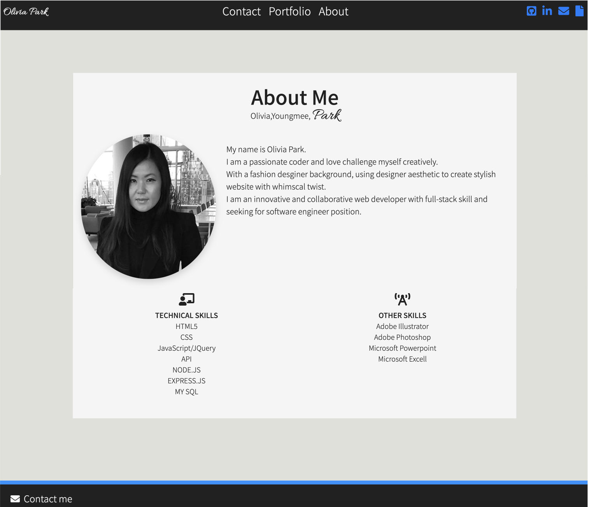
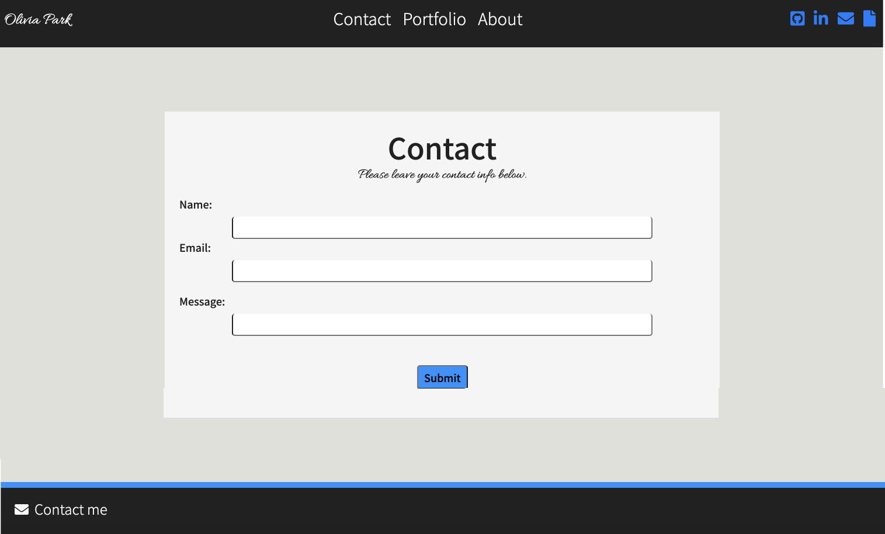
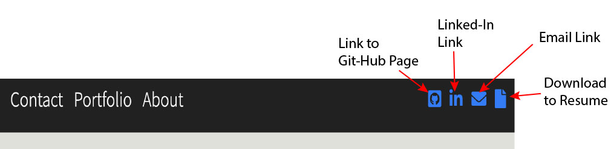
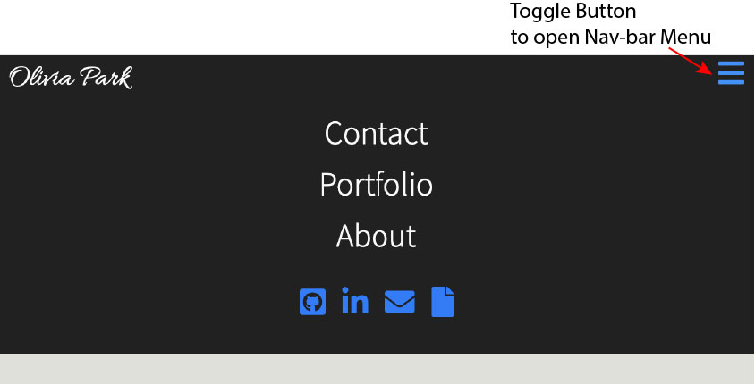
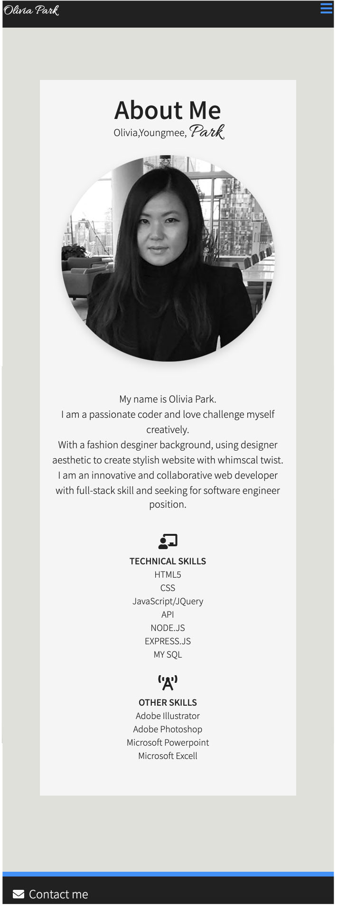
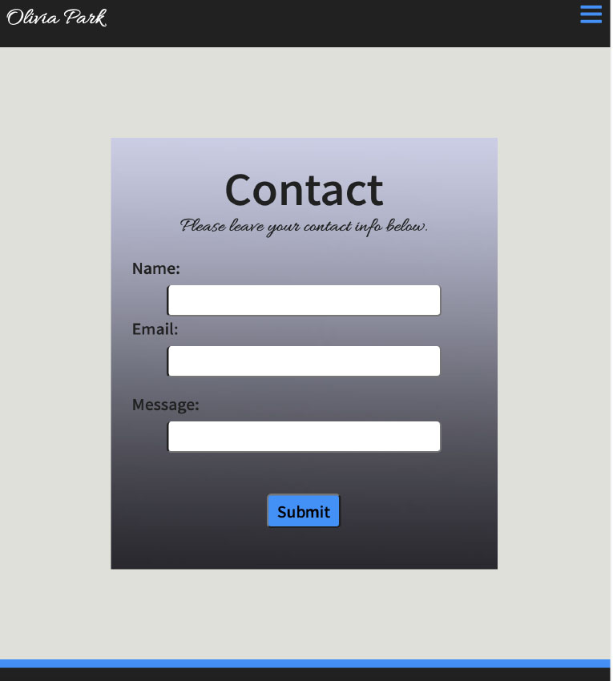
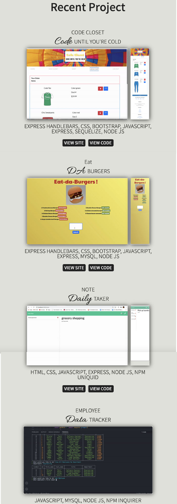

# [React_portfolio_20](https://github.com/Oliviapark113/react_portfolio_20)

## Deployed Website:
## [React_Portfolio_20](https://oliviapark113.github.io/react_portfolio_20/)

### Aboutme page, Portfolio and Contact 
### Refactor all using `REACT` APP
-  Layout: *BootStrap's Grid system*
-  Pseudo Class:  *hover.css*
- Fonts:  *Google fonts*
-  Icons:  *fontsawesome*
-  Javascript:  *element.classList.toggle("classname")* for toggle menu bar.
-  media queries: for *Responsive web page*

### Portfolio demo with recent projects 

##### About me full screen view

- Update with technical skills and other skills

##### Contact page full screen view

##### Portfolio page full screen view

- Display full screen view and responsive view next to each other 
  when click "VIEW SITE" : links to deployed wen page "VIEW CODE" : direct to Git-hub page to view code and readme. 

##### Responsive Nav-Bar 

- Top-left corner has 4 icons: 
 1.Git-Hub page 
 2.Linked-In page 
 3.Email 
 4.Download to resume
 
- This Nav bar also featuring as *responsive*.
when window size gets smaller all menus invisible. 
and small blue *hamberger icon* will appear at top right side of corner of the nav bar. 

- Once you click *hamberger bar* all menus appear. 
   
 

##### RESPONSIVE VIEW 

 

 

  